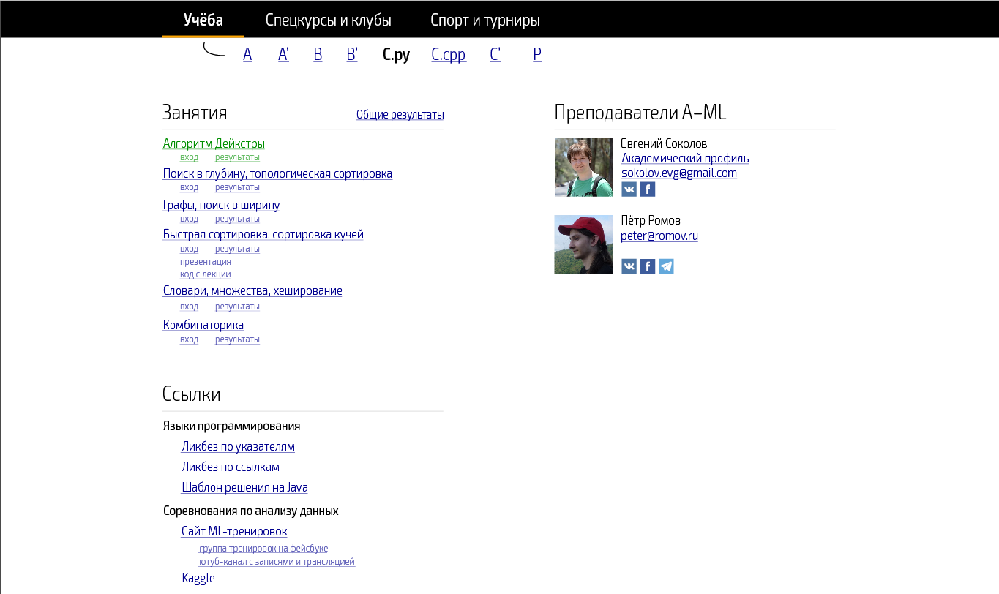
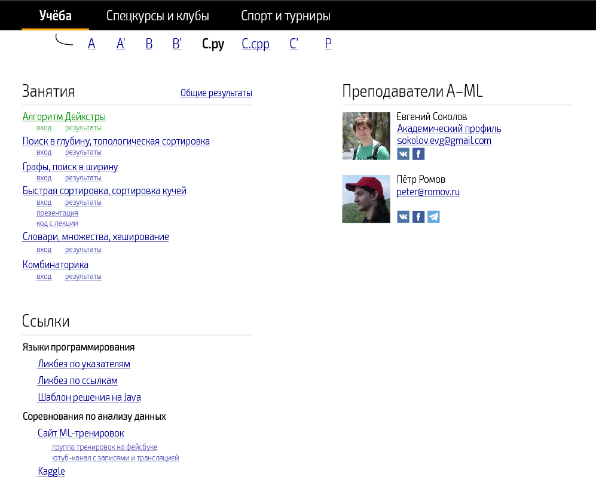
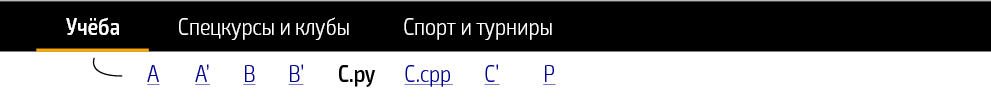
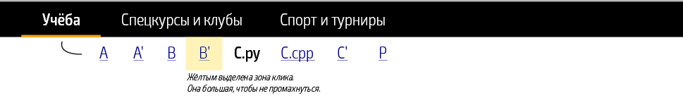
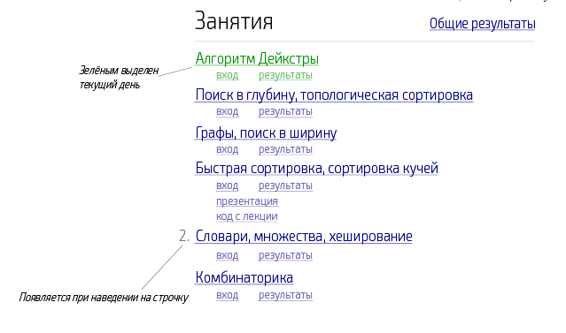
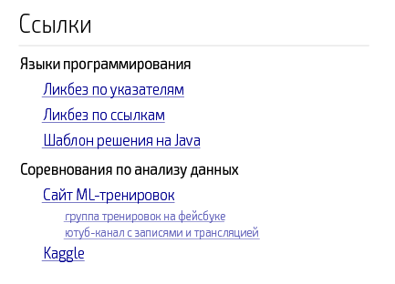
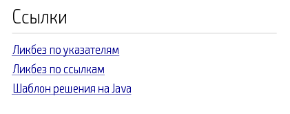
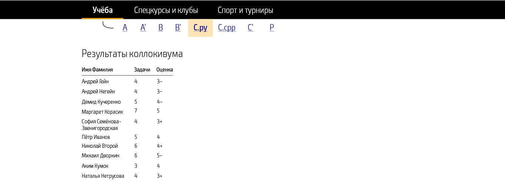
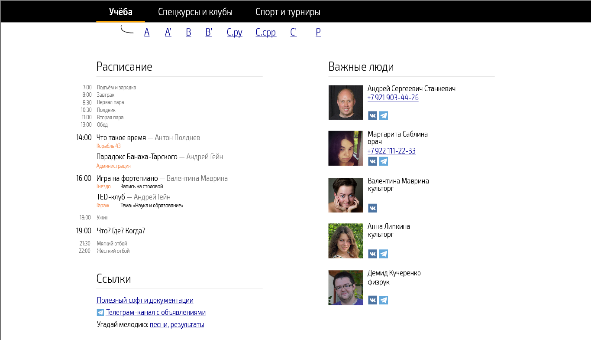

# Страница параллели

У каждой учебной параллели есть своя страница на сервере.
Для школьников на ней выложены условия задач, ссылки на вход в проверяющую систему, таблицы результатов и полезные ссылки.
Мы также добавили на неё информацию о преподавателях паралелли.



Страница имеет фиксированную ширину и большие поля слева и справа. На небольших экранах поля исчезают:



На экране телефон два столбца превращаются в один, блоки располагаются друг по другом.

Страница параллели по умолчанию состоит из трёх блоков: списка занятий, списка полезных ссылок и списка преподавателей. 
Это позволяет гибко изменять страницу: можно придумывать и добавлять новые блоки, перемещать их или удалять.

Наверху находится меню, которое есть на всех страницах:


                                     
Подменю со списком параллелей есть только на страницах параллелей и на главной. В разделах про спецкурсы, клубы, спорт и турниры оно отсутствует.

Параллель, на странице которой мы находимся, выделяется чёрным полужирным шрифтом и ссылкой не является.
Чтобы попадать в названия параллелей было легко, у них большие зоны клика:



Самый главный блок страницы параллелей — это «Занятия»:



Новые занятия появляются сверху и опционально выделяется зелёным цветом.
Стандартными ссылками для каждого занятия являются «вход» и «результаты», но каждую из них можно как настроить (чтобы она вела в другое место), так и отключить.
Кроме того, каждому занятию можно добавить дополнительные ссылки: например, с презентацией или кодом с лекции.

Под блоком занятий находятся полезные ссылки, пополняемые преподавателями:



Ссылки поддерживают трёхуровневую иерархию, но в большинстве случаев стоит пользоваться обычным списком ссылок:



Справа на странице параллели находится список преподавателей. Каждый сможет загрузить произвольную свою фотографию и указать любые контакты (в том числе номер домика и комнаты).
Поддерживается две строки для контактов и одна строка для социальных сервисов: ВКонтакте, Фейсбук, Телеграм. Преподаватель также сможет выбрать, указать ли его по имени и фамилии или по имени, отчеству или фамилии.

По умолчанию будут загружены последние фотографии с poldnev.ru. Если вы хотите поставить другую фотографию, вы можете подготовить её заранее. Размер фотографии — 120 на 120 пикселей, форматы JPG или PNG.

Если необходимо сделать отдельную страницу для одной параллели, то она выглядит так:



В верхнем меню соответствующая параллель становится ссылкой и выделяется.

# Другие страницы

На отдельные страницы вынесены спецкурсы с клубами и спорт с турнирами. Вот так выглядит страница про спецкурсы и клубы:


Новые дни добавляются сверху. Для ещё непрошедших мероприятий указываются локация и необходимые подробности, если есть. Для прошедших — ничего или список ссылок на полезные материалы (например, на презентацию).
Если автор спецкурса хочет выложить много материалов, он может создать отдельную страницу для неё, тогда названия спецкурса становится ссылкой на неё.

На главной странице находятся расписание на сегодняшний день, общие ссылки и список людей, не являющихся преподавателями конкретных параллелей.



В расписании выделены важные вещи: те, которые не повторяются изо дня в день. В расписание будут добавляться не только спецкурсы, клубы и вечерние мероприятия, но и репетиции спектаклей, важные
турнирные матчи и другое.

# Как это будет устроено технически

Для каждой страницы, каждого блока и каждого элемента будут подготовлены HTML-шаблоны.
Например, будут доступны элементы «верхнее меню», «трёхуровневый список ссылок», «карточка преподавателя» и так далее.
Вы сможете взять эти шаблоны и собрать из них любую необходимую страницу. Что-нибудь необычное соберём на месте.

Кроме того, если вам не нужно ничего, кроме того, что поддерживается в стандартных страницах, то вы сможете просто сконфигурировать её. В качестве бэкенда будет использоваться скрипт на PHP,
который уже установлен на нашем сервере. Чтобы сконфигурировать блок уроков вам достаточно будет указать

```php
...
'lessons' => [
    ['title' => 'Алгоритм Дейкстры'],
    ['title' => 'Поиски в ширину и глубину'],
    ...
]
...
```

Аналогичным образом будут управляться все готовые блоки. 
